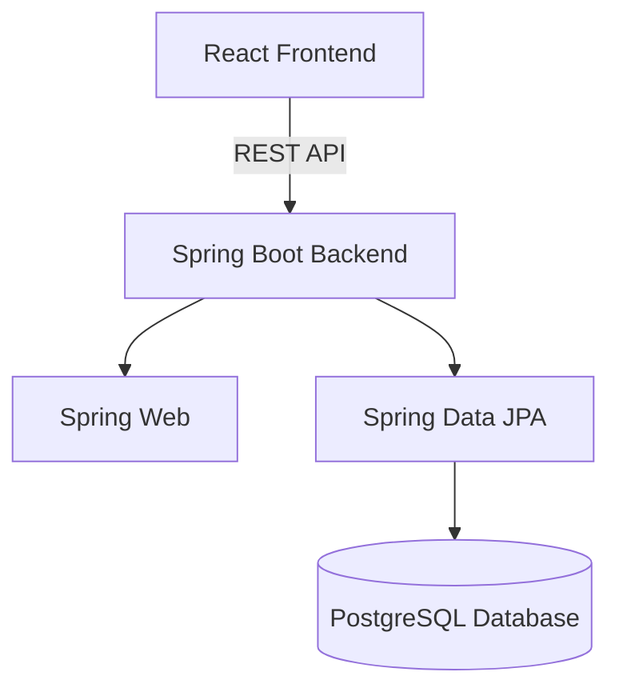

# 🎯 Get a Life

**Get a Life** is a community-driven web application that helps people discover hobbies, reconnect with themselves, and find others to try new activities with.

Many people struggle with free time—not because they lack it, but because they don’t know *how* they want to spend it. Others are endlessly curious and want to try everything, but don’t know where to start.  
Get a Life exists for both.

---

## 🌱 Vision

Our goal is to help users:
- Discover new hobbies based on interests, mood, and budget
- Learn *how* to start a hobby and *what* they need
- Get inspired through visuals and community tips
- Connect with others who want to try the same activities
- Support local communities and small businesses offering these hobbies

This platform is not just about killing time — it’s about **building a life you enjoy**.

---

## ✨ Core Features

### 🔍 Hobby Discovery
- Browse hobbies by **category** (e.g. sports, arts, crafts, social, solo)
- Each hobby includes:
  - Clear description
  - Why it’s good for you
  - What you need to get started
  - Estimated price range
  - Visual **moodboard** for inspiration

### 💖 Wishlist
- Users can save hobbies they want to try
- Wishlist helps users plan future activities and explore interests over time

### 🧑‍🤝‍🧑 Community & Social Features
- See other users who want to try the same hobby
- Message users and try hobbies together
- Especially useful for **group activities** (e.g. volleyball, dancing, hiking)

### 💬 Comments & Tips
- Comment section on each hobby page
- Real experiences and tips from users who already tried it

### ➕ Hobby Suggestions
- Users can suggest new hobbies via a submission form
- Helps keep the platform fresh and community-driven

### 📍 Future Feature: Try It Near You
- Help users find places, workshops, or studios where they can try a hobby
- Potential foundation for a **business model** involving local providers

---

## 🧠 Target Audience

- People who feel lost or bored in their free time
- Curious users who want to explore many interests
- Individuals looking for social activities
- Communities and small business owners offering hobby-related services

---

## 🛠 Tech Stack

### Frontend
- **React**
- Modern component-based architecture
- Responsive UI

### Backend
- **Java**
- **Spring Web**
- **Spring Data JPA**
- **PostgreSQL**

---

## 🧱 Level Architecture

---

## 👥 Project Developers

- **Bálint Csapó** – [@balintcsp01](https://github.com/balintcsp01)
- **Márk Négyesi** – [@mark-4si](https://github.com/mark-4si)
- **Zsuzsanna Bajdik** – [@zsuzsibajdik](https://github.com/zsuzsibajdik)
- **Márton Nagy** – [@TheDev-M](https://github.com/TheDev-M)

---

## 🚀 Getting Started (Coming Soon)

Setup instructions, environment variables, and local development guides will be added as the project progresses.

---

## 📌 Project Status

🟡 **In active development**

Planned next steps:
- Authentication & user profiles
- Hobby CRUD system
- Wishlist functionality
- Community features
- UI/UX polish

---

## 🤝 Contributing

This project is currently maintained by the core team.  
Contribution guidelines will be added once the foundation is stable.

---

## ❤️ Final Note

Get a Life is about more than hobbies.  
It’s about curiosity, connection, and creating a life that feels meaningful—one activity at a time.
